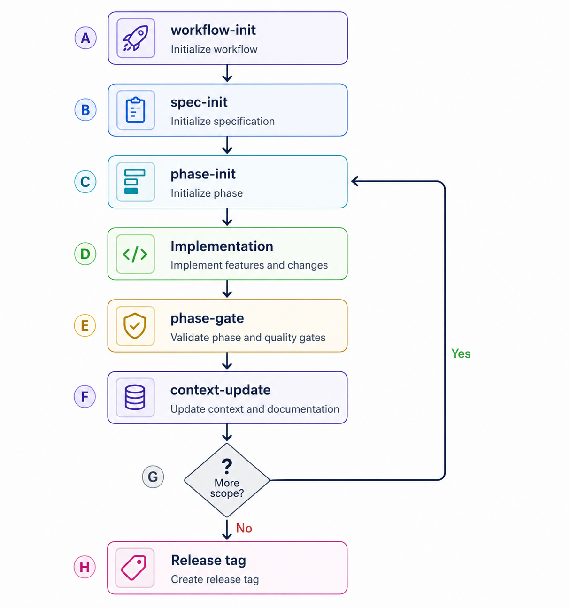

# sdd-workflow

[English](README.md) | [Русский](README.ru.md)

[](https://github.com/avatarsik6699/sdd-workflow/actions/workflows/lint.yml)
[](https://github.com/avatarsik6699/sdd-workflow/actions/workflows/links.yml)
[](https://github.com/avatarsik6699/sdd-workflow/releases)
[](LICENSE)
[](https://avatarsik6699.github.io/sdd-workflow/)

A clean, stack-agnostic Spec-Driven Development workflow that drops into any repository.


## Start in 2 minutes

```bash
git clone https://github.com/avatarsik6699/sdd-workflow.git /tmp/sdd-workflow
cd /tmp/sdd-workflow
# Run in your agent session:
/workflow-init /path/to/your-project
cd /path/to/your-project
```

Then run this loop:

1. `/spec-init`
2. `/phase-init 01`
3. Implement the scoped phase
4. `/phase-gate 01`
5. `/context-update 01`

## Workflow map



## What you get

- Canonical playbooks in `docs/playbooks/`.
- Bootstrap + integrated-project wrappers for Claude Code and Codex.
- Fixed documentation contract (`SPEC.md`, `STATE.md`, `CONTEXT.md`, `CHANGELOG.md`, `PHASE_XX.md`).
- No CLI, no runtime dependency, no build manifest.

## Where to read

- Docs site (EN): <https://avatarsik6699.github.io/sdd-workflow/>
- Docs site (RU): <https://avatarsik6699.github.io/sdd-workflow/ru/>
- Quickstart page: [docs/quickstart.md](docs/quickstart.md)
- FAQ: [docs/faq.md](docs/faq.md)
- Playbooks: [docs/playbooks/](docs/playbooks/)
- Contributing: [docs/CONTRIBUTING.md](docs/CONTRIBUTING.md)

## Repo map

- [docs/playbooks/](docs/playbooks/) — canonical workflow procedures.
- [project-files/](project-files/) — exact tree copied into target projects.
- [.claude/skills/workflow-init/](.claude/skills/workflow-init/) — bootstrap wrapper for this repo.
- [plugins/sdd-workflow/](plugins/sdd-workflow/) — bootstrap plugin for Codex.
- [AGENTS.md](AGENTS.md) — rules for working on this repository.

## License

MIT
