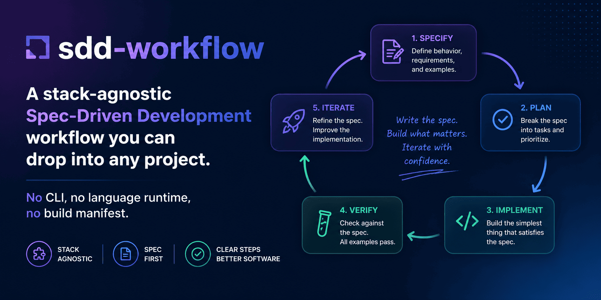
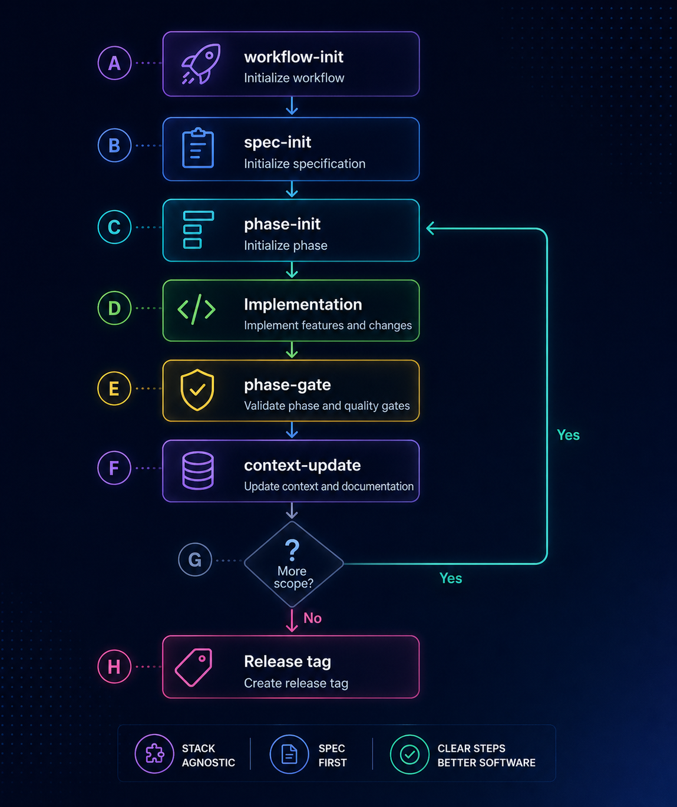

# sdd-workflow

[English](README.md) | [Русский](README.ru.md)

[](https://github.com/avatarsik6699/sdd-workflow/actions/workflows/lint.yml)
[](https://github.com/avatarsik6699/sdd-workflow/actions/workflows/links.yml)
[](https://github.com/avatarsik6699/sdd-workflow/releases)
[](LICENSE)
[](https://avatarsik6699.github.io/sdd-workflow/)

A clean, stack-agnostic Spec-Driven Development workflow that drops into any repository.
It defines a documentation contract, a repeatable phase loop, and clear gate criteria so teams can move from requirements to implementation with predictable checkpoints.



## Getting started

### 1. Clone the workflow bundle

```bash
git clone https://github.com/avatarsik6699/sdd-workflow.git /tmp/sdd-workflow
```

### 2. Bootstrap into your project

Open an AI agent session with `/tmp/sdd-workflow` as the working directory, then pick one option:

**Option A — slash command** (Claude Code CLI or Codex with the plugin loaded)

```
/workflow-init /absolute/path/to/your-project
```

**Option B — bootstrap prompt** (any AI: claude.ai chat, Cursor, Copilot, etc.)

Paste the following into the chat:

```
Read docs/playbooks/workflow-init.md and execute the workflow-init procedure.
Target project path: /absolute/path/to/your-project
```

> **Why two options?** `/workflow-init` is a slash command that auto-loads only when the agent
> runtime reads `.claude/skills/workflow-init/SKILL.md` at session start — this happens reliably
> in Claude Code CLI but may not happen in chat interfaces or other tools. The bootstrap prompt
> reads the same canonical playbook directly and produces the same result without relying on
> skill registration.

### 3. Enter your target project and run the delivery loop

```bash
cd /path/to/your-project
```

Initialize the workflow in your target project once, then run this delivery loop for each phase:

1. `/spec-init` — draft or refresh `docs/SPEC.md`
2. `/phase-init 01` — scaffold `docs/PHASE_01.md` + per-task `docs/PHASE_01_NOTES.md`
3. *(optional)* `/phase-explore 01` — explore codebase per task before planning; records patterns, constraints, and risks
4. *(optional)* `/impl-brief 01` — generate concrete per-task implementation plans
5. Implement the scoped phase (manually, via agent, or hybrid)
6. *(optional)* `/phase-add-task 01 "description"` — add an unplanned task mid-phase; auto-assigns ID, derives contracts, plans
7. *(optional)* `/impl-assist 01` — let the agent implement unchecked tasks
8. `/phase-gate 01` — run checks and validate architect review notes
9. `/context-update 01` — finalize the phase and sync context documents
10. *(optional)* `/project-sync` — mirror task statuses to GitHub Issues + Projects Kanban board

## Workflow map



## What you get

- Canonical playbooks in `docs/playbooks/` that define each workflow skill and the expected procedure.
- Bootstrap and integrated-project wrappers for Claude Code and Codex, so teams can apply the same process in different agent environments.
- A fixed documentation contract (`SPEC.md`, `STATE.md`, `CONTEXT.md`, `CHANGELOG.md`, `PHASE_XX.md`, `PHASE_XX_NOTES.md`) that keeps planning, execution, and project memory in sync.
- Optional GitHub integration: `/project-sync` keeps a GitHub Projects v2 Kanban board in sync with your phase task checkboxes — no manual board updates needed.
- No CLI, no runtime dependency, and no build manifest: the workflow ships as portable documentation and wrappers.

## How the workflow is used

In a target repository, the first step (`/workflow-init`) installs the workflow files and skill wrappers.
After that, each phase follows the same pattern: define scope from SPEC, optionally generate per-task implementation plans, implement only that scope (manually or via agent), run a gate review, and update context documents.
This structure keeps scope controlled and gives contributors a consistent way to understand project status over time.

## Where to read

- Docs site (EN): <https://avatarsik6699.github.io/sdd-workflow/>
- Docs site (RU): appears at `/ru/` on the same domain after the first bilingual Pages deploy
- Quickstart page: [docs/quickstart.md](docs/quickstart.md)
- Skills catalog: [docs/skills.md](docs/skills.md)
- FAQ: [docs/faq.md](docs/faq.md)
- Playbooks: [docs/playbooks/](docs/playbooks/)
- Contributing: [docs/CONTRIBUTING.md](docs/CONTRIBUTING.md)

## Repo map

- [docs/playbooks/](docs/playbooks/) — canonical workflow procedures.
- [project-files/](project-files/) — exact tree copied into target projects.
- [.claude/skills/workflow-init/](.claude/skills/workflow-init/) — bootstrap wrapper for this repo.
- [plugins/sdd-workflow/](plugins/sdd-workflow/) — bootstrap plugin for Codex.
- [AGENTS.md](AGENTS.md) — rules for working on this repository.

> **Note on visible skills:** from this repository only `/workflow-init` is registered as a
> slash command. The 9 workflow skills (`/spec-init`, `/phase-init`, `/phase-explore`, etc.)
> live in `project-files/.claude/skills/` — they are templates copied into target projects by
> `/workflow-init`, and become available only when an agent session is opened inside that target
> project.

## License

MIT
