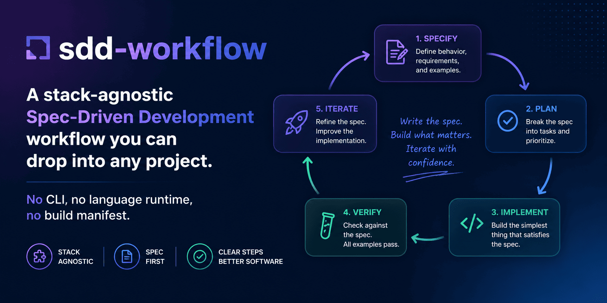

# sdd-workflow

[English](README.md) | [Русский](README.ru.md)

[](https://github.com/avatarsik6699/sdd-workflow/actions/workflows/lint.yml)
[](https://github.com/avatarsik6699/sdd-workflow/actions/workflows/links.yml)
[](https://github.com/avatarsik6699/sdd-workflow/releases)
[](LICENSE)
[](https://avatarsik6699.github.io/sdd-workflow/)

Чистый, стек-агностичный workflow Spec-Driven Development, который можно подключить в любой репозиторий.
Он задаёт единый контракт документации, повторяемый цикл фаз и прозрачные критерии проверки, чтобы команда двигалась от требований к реализации без потери контекста.



## Начало работы

```bash
git clone https://github.com/avatarsik6699/sdd-workflow.git /tmp/sdd-workflow
cd /tmp/sdd-workflow
# Запускать в сессии агента:
/workflow-init /path/to/your-project
cd /path/to/your-project
```

Инициализируйте workflow в целевом проекте один раз, затем используйте этот цикл для каждой фазы:

1. `/spec-init` — создать или обновить `docs/SPEC.md`
2. `/phase-init 01` — сгенерировать `docs/PHASE_01.md` + `docs/PHASE_01_NOTES.md` с task ID
3. *(опционально)* `/impl-brief 01` — сгенерировать конкретные планы реализации по каждой задаче
4. Реализовать scope фазы (вручную, силами агента или гибрид)
5. *(опционально)* `/impl-assist 01` — агент реализует невыполненные задачи
6. `/phase-gate 01` — запустить проверки и architect review notes
7. `/context-update 01` — завершить фазу, синхронизировать контекстные документы
8. *(опционально)* `/project-sync` — зеркалировать статусы задач в GitHub Issues + Projects Kanban-доску

## Схема процесса


## Что вы получаете

- Канонические playbooks в `docs/playbooks/`, где описана процедура для каждого шага workflow.
- Обёртки для Claude Code и Codex (bootstrap и для интегрированного проекта), чтобы использовать один и тот же процесс в разных агентных средах.
- Фиксированный контракт документации (`SPEC.md`, `STATE.md`, `CONTEXT.md`, `CHANGELOG.md`, `PHASE_XX.md`, `PHASE_XX_NOTES.md`), синхронизирующий план, реализацию и историю решений.
- Опциональная GitHub-интеграция: `/project-sync` синхронизирует GitHub Projects v2 Kanban-доску с чекбоксами задач в фазовых файлах — без ручного обновления доски.
- Без CLI, без runtime-зависимостей и без build-манифеста: workflow поставляется как переносимый набор документации и обёрток.

## Как применяется workflow

В целевом репозитории первый шаг (`/workflow-init`) добавляет все необходимые файлы и skill-обёртки.
Дальше каждая фаза проходит одинаково: уточнение scope из SPEC, опциональное создание планов по задачам, реализация только согласованного объёма (вручную или агентом), gate-проверка и обновление контекстных документов.
Такой цикл помогает удерживать границы задач и делает текущее состояние проекта понятным для всей команды.

## Где читать документацию

- Docs site (EN): <https://avatarsik6699.github.io/sdd-workflow/>
- Docs site (RU): <https://avatarsik6699.github.io/sdd-workflow/ru/>
- Быстрый старт: [docs/quickstart.md](docs/quickstart.md)
- Каталог навыков: [docs/skills.md](docs/skills.md)
- FAQ: [docs/faq.md](docs/faq.md)
- Playbooks: [docs/playbooks/](docs/playbooks/)
- Руководство по вкладу: [docs/CONTRIBUTING.md](docs/CONTRIBUTING.md)

## Карта репозитория

- [docs/playbooks/](docs/playbooks/) — канонические процедуры workflow.
- [project-files/](project-files/) — дерево, копируемое в целевой проект.
- [.claude/skills/workflow-init/](.claude/skills/workflow-init/) — bootstrap-обёртка для этого репозитория.
- [plugins/sdd-workflow/](plugins/sdd-workflow/) — bootstrap-плагин для Codex.
- [AGENTS.md](AGENTS.md) — правила работы с этим репозиторием.

## Лицензия

MIT
