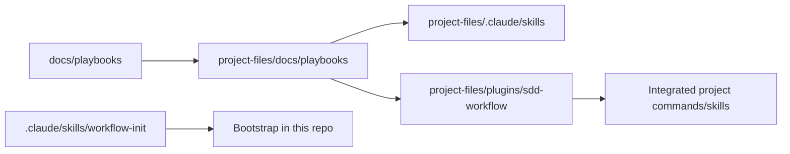

# Architecture

## Relationship model

- `docs/playbooks/` is canonical for workflow procedures.
- `project-files/` is the distributable payload copied into target projects.
- Root `.claude/skills/workflow-init` and `plugins/sdd-workflow/` expose bootstrap from this repository itself.
- Integrated projects execute only the five derived skills, not this repo-local bootstrap wrappers.
