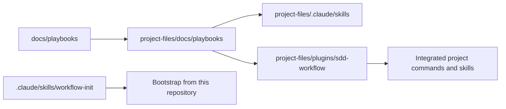

# Architecture

## Relationship model

- `docs/playbooks/` is canonical for workflow procedures.
- `project-files/` is the distributable payload copied into target projects.
- Root wrappers expose bootstrap from this repository only.
- Integrated projects run the five derived skills after bootstrap.
