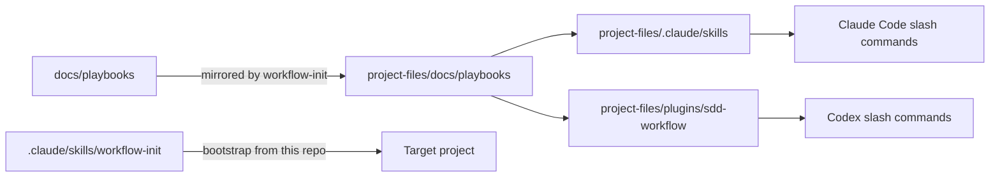

# Architecture

## Repository layout

```
sdd-workflow/                          ← This repository
├── docs/playbooks/                    ← Canonical workflow procedures (9 files)
│   ├── workflow-init.md
│   ├── spec-init.md
│   ├── phase-init.md
│   ├── phase-gate.md
│   ├── spec-sync.md
│   ├── context-update.md
│   ├── impl-brief.md                  ← generate per-task implementation plans
│   ├── impl-assist.md                 ← agent-driven task implementation
│   └── project-sync.md                ← GitHub Issues + Projects Kanban sync
├── project-files/                     ← Everything /workflow-init copies into target
│   ├── AGENTS.md                      ← Agent rules (stack-agnostic)
│   ├── CLAUDE.md                      ← Claude Code adapter
│   ├── .mcp.json                      ← Context7 MCP wiring
│   ├── .claude/skills/<9>/SKILL.md   ← Thin Claude Code wrappers
│   ├── plugins/sdd-workflow/          ← Codex wrappers + hooks
│   ├── docs/playbooks/<9>.md          ← Mirror of docs/playbooks/
│   └── docs/templates/<9 files>       ← Seeded document scaffolds
├── .claude/skills/workflow-init/      ← Bootstrap wrapper (this repo only)
└── plugins/sdd-workflow/              ← Bootstrap plugin for Codex
```

## Playbook distribution model



- `docs/playbooks/` is the single source of truth for all workflow logic.
- `project-files/` is the distributable payload — copied verbatim into target projects by `/workflow-init`.
- Wrappers in `.claude/skills/` and `plugins/sdd-workflow/` are one-line stubs that point to the playbooks.
  **Never put workflow logic in a wrapper.**

## Document contract (inside an integrated project)

| File | Role | Who writes |
| ---- | ---- | ---------- |
| `docs/SPEC.md` | Strategic brief: goals, domain, phases | Architect via `/spec-init` |
| `docs/CONTEXT.md` | Living technical contract: schema, endpoints, env vars | Agent via `/context-update` |
| `docs/STATE.md` | Operational tracker: phase statuses, blockers | Agent + architect |
| `docs/CHANGELOG.md` | History of spec/context changes | Agent via `/spec-sync`, `/context-update` |
| `docs/PHASE_XX.md` | Per-phase mini-spec: scope checklist (task IDs), contracts, gate checks | Agent via `/phase-init` |
| `docs/PHASE_XX_NOTES.md` | Per-task implementation guide: plans + decisions | Agent (`impl-brief`) + human |
| `docs/STACK.md` | Stack-specific setup, test commands, gate commands, GitHub Project config | Human + `/workflow-init` |
| `docs/DECISIONS.md` | ADR log | Human |
| `docs/KNOWN_GOTCHAS.md` | Recurring pitfall log | Human + agent |

## Phase lifecycle

```
spec-init ──► phase-init ──► [impl-brief] ──► implement ──► [impl-assist] ──► phase-gate ──► context-update
                                                                                                    │
                                                                          [project-sync] ◄──────────┘
```

1. **`/spec-init`** — architect provides brief → agent drafts `SPEC.md`, iterates clarifications.
2. **`/phase-init N`** — agent scaffolds `PHASE_N.md` with task IDs (`B1`, `F1`…), dependency chains, and contracts extracted from `SPEC.md`. Also creates stub `PHASE_N_NOTES.md`.
3. **`/impl-brief N [ID|group]`** *(optional)* — agent reads contracts + source code → writes concrete Implementation Plans into `PHASE_N_NOTES.md`. Plans include *Done when*, *Follows pattern*, file list, code signatures, and step-by-step order.
4. **Implement** — human or agent (or hybrid) works against the scope checklist:
   - Human: implements tasks, checks off boxes.
   - Agent (`/impl-assist`): reads Implementation Plan, verifies by actual code, commits atomically per task, checks off boxes.
5. **`/phase-gate N`** — runs commands from `docs/STACK.md#gate-commands`, reports PASS/FAIL per check plus unresolved architect review notes.
6. **`/context-update N`** — bumps `CONTEXT.md` version (patch or minor), updates `STATE.md` and `CHANGELOG.md`.
7. **`/project-sync`** *(optional)* — syncs every `PHASE_N.md` task checkbox to a GitHub Issues + Projects v2 Kanban board. Idempotent.

## Implementation paths

| Path | Description |
| ---- | ----------- |
| **Agent-driven** | `/impl-brief N` → review plans → `/impl-assist N` |
| **Human-driven** | implement against checklist; check off tasks manually |
| **Hybrid** | mix: agent for some task IDs (`/impl-brief N B2` → `/impl-assist N B2`), human for others |

**File ownership in `PHASE_N_NOTES.md`:**

| Section | Owner | Agent behaviour |
| ------- | ----- | --------------- |
| `### Implementation Plan` | Agent (`impl-brief`) | Written once; `--force` to overwrite |
| `### Decisions & Notes` | Human only | Never read or written by any agent |

## GitHub integration model

`/project-sync` treats markdown as the source of truth and GitHub as a read-only view:

- Each task in `PHASE_XX.md § Scope` maps to a GitHub Issue with a hidden marker `<!-- sdd-sync: PHASE_XX/B1 -->`.
- On every run: fetch all issues labelled `sdd-workflow`, diff against current markdown, apply only the delta (create / close / reopen / set-column / archive).
- Task `[ ]` → Issue open, column set by phase status; task `[x]` → Issue closed, column Done.
- Removed tasks → Issue closed + labelled `sdd-removed` (never hard-deleted).

Run `/project-sync --setup` once to create the GitHub Project, columns, and label.
