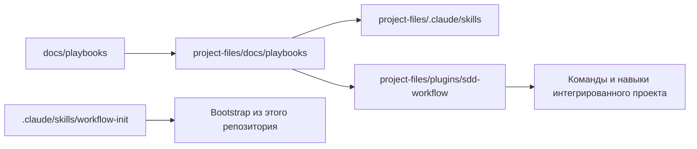

# Архитектура

## Модель связей

- `docs/playbooks/` — канонический источник процедур workflow.
- `project-files/` — дистрибутив, который копируется в целевой проект.
- Root-обёртки используются только для bootstrap из этого репозитория.
- После bootstrap в интегрированном проекте работают пять производных навыков.
