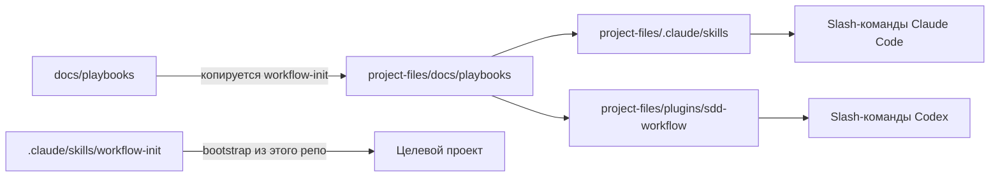

# Архитектура

## Структура репозитория

```
sdd-workflow/                          ← Этот репозиторий
├── docs/playbooks/                    ← Канонические процедуры workflow (9 файлов)
│   ├── workflow-init.md
│   ├── spec-init.md
│   ├── phase-init.md
│   ├── phase-gate.md
│   ├── spec-sync.md
│   ├── context-update.md
│   ├── impl-brief.md                  ← генерация планов реализации по задачам
│   ├── impl-assist.md                 ← реализация задач силами агента
│   └── project-sync.md                ← синхронизация GitHub Issues + Projects Kanban
├── project-files/                     ← Всё, что /workflow-init копирует в целевой проект
│   ├── AGENTS.md                      ← Правила агента (стек-агностичные)
│   ├── CLAUDE.md                      ← Адаптер Claude Code
│   ├── .mcp.json                      ← Подключение Context7 MCP
│   ├── .claude/skills/<9>/SKILL.md   ← Тонкие обёртки для Claude Code
│   ├── plugins/sdd-workflow/          ← Обёртки Codex + хуки
│   ├── docs/playbooks/<9>.md          ← Зеркало docs/playbooks/
│   └── docs/templates/<9 файлов>      ← Шаблоны документов
├── .claude/skills/workflow-init/      ← Bootstrap-обёртка (только для этого репо)
└── plugins/sdd-workflow/              ← Bootstrap-плагин для Codex
```

## Модель дистрибуции плейбуков



- `docs/playbooks/` — единственный источник истины для всей логики workflow.
- `project-files/` — дистрибутив, который `/workflow-init` копирует в целевые проекты без изменений.
- Обёртки в `.claude/skills/` и `plugins/sdd-workflow/` — однострочные заглушки, указывающие на плейбуки.
  **Никогда не помещайте логику workflow в обёртку.**

## Контракт документации (в интегрированном проекте)

| Файл | Роль | Кто пишет |
| ---- | ---- | --------- |
| `docs/SPEC.md` | Стратегический бриф: цели, домен, фазы | Архитектор через `/spec-init` |
| `docs/CONTEXT.md` | Живой технический контракт: схема, эндпоинты, env vars | Агент через `/context-update` |
| `docs/STATE.md` | Операционный трекер: статусы фаз, блокеры | Агент + архитектор |
| `docs/CHANGELOG.md` | История изменений spec/context | Агент через `/spec-sync`, `/context-update` |
| `docs/PHASE_XX.md` | Мини-спек фазы: чеклист задач (с ID), контракты, gate checks | Агент через `/phase-init` |
| `docs/PHASE_XX_NOTES.md` | Руководство по реализации: планы + решения | Агент (`impl-brief`) + человек |
| `docs/STACK.md` | Стековые настройки, команды тестов, gate-команды, конфиг GitHub Project | Человек + `/workflow-init` |
| `docs/DECISIONS.md` | Журнал ADR | Человек |
| `docs/KNOWN_GOTCHAS.md` | Журнал повторяющихся ловушек | Человек + агент |

## Жизненный цикл фазы

```
spec-init ──► phase-init ──► [impl-brief] ──► реализация ──► [impl-assist] ──► phase-gate ──► context-update
                                                                                                     │
                                                                           [project-sync] ◄───────────┘
```

1. **`/spec-init`** — архитектор предоставляет бриф → агент создаёт `SPEC.md`, уточняет вопросы.
2. **`/phase-init N`** — агент создаёт `PHASE_N.md` с task ID (`B1`, `F1`…), цепочками зависимостей и контрактами из `SPEC.md`. Также создаёт заглушку `PHASE_N_NOTES.md`.
3. **`/impl-brief N [ID|group]`** *(опционально)* — агент читает контракты + исходный код → записывает конкретные Implementation Plans в `PHASE_N_NOTES.md`. Планы включают *Done when*, *Follows pattern*, список файлов, сигнатуры кода и пошаговый порядок.
4. **Реализация** — человек или агент (или гибрид) работает по чеклисту scope:
   - Человек: реализует задачи, отмечает чекбоксы.
   - Агент (`/impl-assist`): читает Implementation Plan, проверяет фактический код, коммитит атомарно по задаче, отмечает чекбоксы.
5. **`/phase-gate N`** — запускает команды из `docs/STACK.md#gate-commands`, выдаёт PASS/FAIL по каждой проверке + непроверенные architect review notes.
6. **`/context-update N`** — обновляет версию `CONTEXT.md` (patch или minor), обновляет `STATE.md` и `CHANGELOG.md`.
7. **`/project-sync`** *(опционально)* — синхронизирует чекбоксы задач из `PHASE_N.md` с GitHub Issues + GitHub Projects v2 Kanban-доской. Идемпотентен.

## Пути реализации

| Путь | Описание |
| ---- | -------- |
| **Агент** | `/impl-brief N` → проверить планы → `/impl-assist N` |
| **Человек** | реализовать по чеклисту, вручную отмечать задачи |
| **Гибрид** | смешанный: агент для части задач (`/impl-brief N B2` → `/impl-assist N B2`), человек — для остальных |

**Ответственность за разделы `PHASE_N_NOTES.md`:**

| Раздел | Владелец | Поведение агента |
| ------ | -------- | ---------------- |
| `### Implementation Plan` | Агент (`impl-brief`) | Пишется один раз; `--force` для перезаписи |
| `### Decisions & Notes` | Только человек | Никогда не читается и не записывается агентом |

## Модель GitHub-интеграции

`/project-sync` рассматривает markdown как источник истины, а GitHub — как view-only:

- Каждая задача в `PHASE_XX.md § Scope` соответствует GitHub Issue со скрытым маркером `<!-- sdd-sync: PHASE_XX/B1 -->`.
- При каждом запуске: получить все issues с меткой `sdd-workflow`, сравнить с текущим markdown, применить только дельту (создать / закрыть / переоткрыть / переместить колонку / архивировать).
- Задача `[ ]` → Issue открыт, колонка определяется статусом фазы; задача `[x]` → Issue закрыт, колонка Done.
- Удалённые задачи → Issue закрыт + метка `sdd-removed` (никогда не удаляется напрямую).

Запустите `/project-sync --setup` один раз, чтобы создать GitHub Project, колонки и метку.
