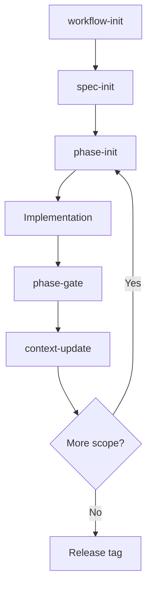

# sdd-workflow

A stack-agnostic Spec-Driven Development workflow you can apply to existing or new projects.

## Workflow map

## What this gives you

- Five reusable SDD skills inside target projects
- Canonical playbooks in plain Markdown
- Agent-agnostic wrappers for Claude Code and Codex
- Fixed documentation contract for SPEC/STATE/CONTEXT/CHANGELOG and phase files

Start with [Quickstart](quickstart.md).
